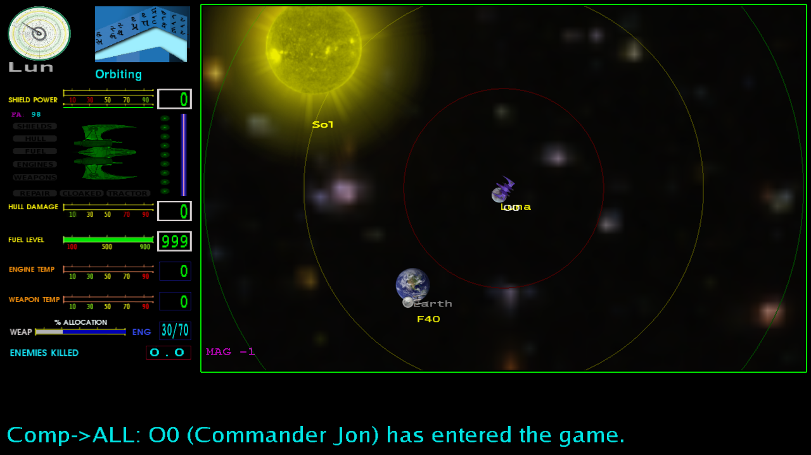
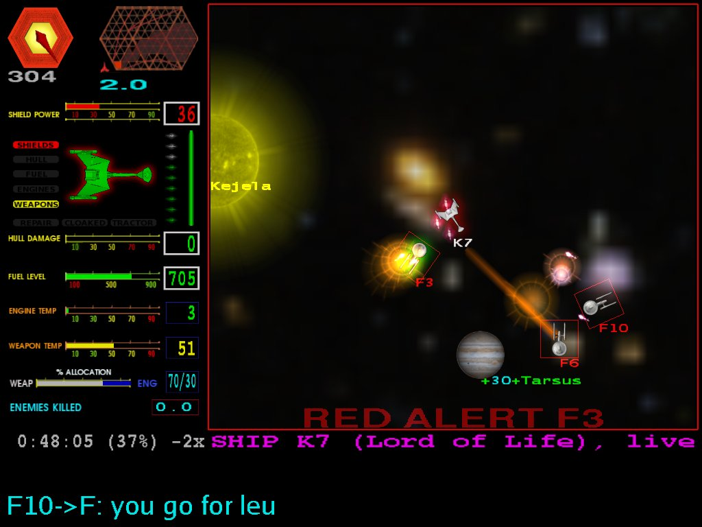
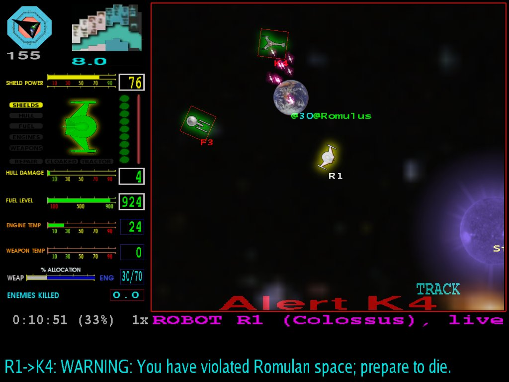
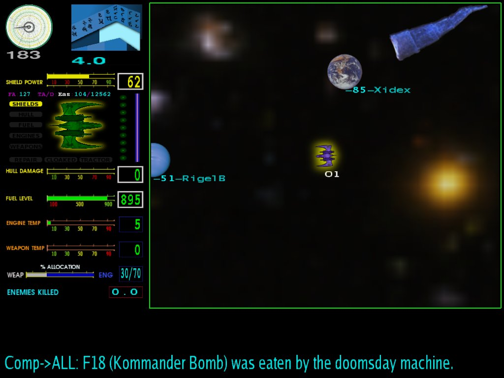

# conquest

Conquest is a top-down, real time space warfare game.  It was
originally written in RATFOR for the VAX/VMS system in 1983 by Jef
Poskanzer and Craig Leres.

I spent incredible amounts of time playing this game with my friends
in the terminal labs at college, and when I actually had a multi-user
system running at home (Unixware) I decided to try and translate/port
the code to C in Unix.  This was in the early to mid 1990's.

Of course, over the years many things have changed. Today, Conquest is
a true client/server game.  The client uses freeglut, SDL 1.2 (for
sound) and OpenGL.  It uses C++11 to build, though for now it's "C
software with some C++ containers and constructs".

The curses client is no longer provided.

## License

Conquest is released under the [MIT License](LICENSE.txt).

## Playing the game

Conquest is a client that must connect over a network to a conquestd
server.

```conquest ```

By default, when running conquest without options, it will
query the meta-server at conquest.radscan.com to get a list of
currently available servers.  Pick one, login, and play.

Alternatively, you can specify a specific server with the "-s" option:

```conquest -s localhost:1701```

The port number is optional, and will default to 1701.

You can get a list of the currently active servers via your web browser
by going to https://radscan.com/cgi-bin/conqmeta.pl

### The goal of the game

The goal of the game is to conquer the Universe by bombing planets,
placing your team's armies on them and fighting off any ships that
want to ruin your day.  When all of the core planets have been taken
by your team, the game is reset to start the carnage all over again.

## Build Requirements

To build and run Conquest, you will need:

* automake/autoconf/libtool - The whole autoconf system.
* X11 development headers and libraries (all of them)
* OpenGL development headers and libraries. Conquest uses OpenGL
  version 1.x.
* glut/freeglut development headers and libraries
* SDL 1.2 and SDL_mixer 1.2, if you want sound (you do).
* g++ 4.9 or better, or clang++ 3.4 or better

On a Kubuntu/Ubuntu 17.10 system, the following should install the
required packages to build the server and client:

```
sudo apt-get install build-essential autoconf automake libtool \
     libsdl1.2-dev libsdl-mixer1.2-dev ncurses-dev bison flex \
     freeglut3-dev libxi-dev libxmu-dev
```

Conquest supports Linux systems and has also been tested on MAC OSX
with the ports collection. I currently develop on Kubuntu 16.04.

In the past, other Unix systems were supported like the BSD's
(FreeBSD, OpenBSD, etc) as will as Digital Unix for Alpha processors,
and Sun/Oracle Solaris.

These have not been tested in a while, so if there are problems,
please feel free to send patches.  If they work, I'd love to know.

The last release of conquest in 2010 also supported the conquest
client on MS Windows systems (XP and Windows 7) using MinGW.  This has
also not been tested in a while, but I plan to support this again
later.

### Building Conquest

First, create the conquest group:

```sudo groupadd conquest```

Conquest requires it's own group to prevent cheating or interference
with the game data.

Then:

```
sh ./autogen.sh
./configure
make
sudo make install
```

## Mailing List

There is a low volume mailing list for Conquest.  You can subscribe
[here](https://radscan.com/cgi-bin/mailman/listinfo/conquest).

## IRC Channel

There is an IRC Channel (#conquest) for Conquest on chat.freenode.net.

## Further information

* The [Conquest Guide](docs/conquest-guide.md). This document gives
  you some more information on Conquest and explains how to play it
  (bomb planets, fight robot ships, etc).  It also provides
  information on navigation and other things you might want to know.

* A Conquest player put up this
  [Strategy Guide](https://cataboligne.org/index.php?itemid=17) some
  years ago.  While a little dated, it still has some good
  information for new players.

* The [HISTORY](docs/HISTORY.txt) file.  This document gives
  an overview of changes between releases.

* The [Server Guide](docs/server-guide.md) has instructions for those
  wanting to run their own Conquest servers.

* Marisa Giancaria has setup a
  [Conquest Gameplayers Club Community Page](https://conquest.gameplayer.club/)
  for players and operators who wish to participate.  Also available
  are tools to help potential server operators who are not familiar
  with the Linux/Unix command line.

* The [CQI Parser Documentation](docs/conqinit.txt) provides
  information on the format and types of files the Conquest server and
  client uses to configure itself.  The Universe (planets, etc),
  textures, animations, and sound information are all handled by this
  parser.  At startup, Conquest's executables will look for these
  files in *prefix*/etc/conquest/ .  This is primarily of interest to
  those wanting to run a server with a modified Universe.

## Some screenshots

NOTE: Some of these were taken using the recordings of actual game
play.  At some point I'll update them to a more recent version of
Conquest, but you should get the idea.

### Short Range View


### Long Range View


### A little war


### A mad robot


### The Doomsday Machine

